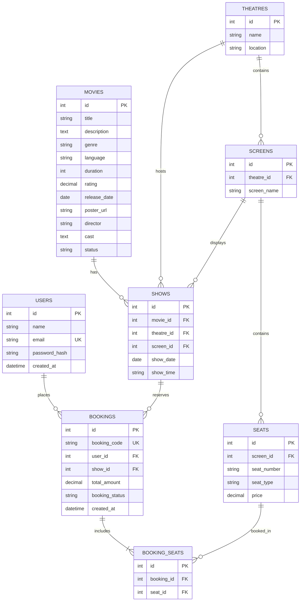

# 🎬 CineAI — AI Movie Ticket Booking Assistant
> **UPS Hackathon Project Submission**  
> An intelligent, end-to-end movie ticket discovery and booking platform featuring natural language cinema recommendations, AI-powered seat optimization, real-time showtime scheduling, and zero double-booking transactional guarantees.

---

## 📌 Problem Statement
Finding the right movie, filtering showtimes across scattered multiplexes, and securing optimal viewing seats can be tedious and time-consuming. Users often struggle to match their mood, group dynamics (family vs. date night), and language preferences with current screenings.

## 💡 Solution
**CineAI** bridges the gap with a modern conversational concierge and booking engine that:
1. **Discovers & Recommends Movies**: Interprets natural language queries (e.g. *"I want a funny movie with my family"*, *"Suggest a Tamil action movie tonight"*) using semantic entity extraction.
2. **Finds Suitable Theatres & Timings**: Aggregates multiplex show schedules (PVR, INOX, AGS, SPI, Cinepolis).
3. **AI Seat Recommendation**: Evaluates cinema screen acoustics and viewing angles to suggest middle-row, center-aligned contiguous seats (e.g. C4 & C5).
4. **Guarantees Transaction Integrity**: Prevents double booking via database-level transactional validation.
5. **Issues Digital E-Tickets**: Provides downloadable, barcode-verified passes with unique booking codes (`UPS-MOV-XXXXXX`).

---

## 🏗️ System Architecture

```
User (Browser)
   │
   ▼
React + Vite Frontend (Cinema Dark Theme & Glassmorphism UI)
   │ (Axios REST calls / JWT Auth / Toast Alerts / Interactive CineAI Assistant)
   ▼
FastAPI Backend (Uvicorn / Pydantic / SQLAlchemy / CORS Enabled)
   ├── Routers: auth, movies, theatres, shows, seats, bookings, ai
   └── Services: ai_service, recommendation_service, booking_service
   │
   ▼
MySQL Database (`movie_booking_db` with Schema + Seed Data)
```

---

## ✨ Key Features

- **🏠 Cinematic Landing Page**: Dynamic hero search, stats metric counter (Movies, Theatres, Shows Today, Bookings), Now Showing, Trending, and AI Curated categories.
- **🔍 Multi-Criteria Movie Search**: Live keyword search across titles, actors, directors, genres (Action, Comedy, Romance, Thriller, Sci-Fi, Horror), languages (Tamil, Hindi, English), and ratings (8.0+ ⭐).
- **✨ CineAI Floating Chatbot**:
  - Context-aware natural language understanding.
  - Generates rich interactive movie cards inside chat bubbles with instant *"Book Now"* actions.
  - Hybrid intelligence: 100% functional offline rule-based NLP + optional plug-and-play LLM support.
- **🎦 Theatre & Showtime Selection**: Date strip picker (Today, Tomorrow, Upcoming) with multiplex cards and showtime badges (10:30 AM, 1:45 PM, 4:30 PM, 7:15 PM, 10:30 PM).
- **💺 Interactive Seat Matrix**:
  - Tiers: Regular (₹150), Premium (₹220), VIP (₹300).
  - Curved illuminated cinema screen indicator.
  - Real-time seat status (Available, Selected, Booked, AI Pick).
- **🧠 "Suggest Best Seats" AI Engine**: Automatically highlights and picks the highest-rated center line-of-sight seats with an explanation banner.
- **💳 Simulated Checkout & Mock Payment**: UPI (with QR code scanner simulation), Credit/Debit Card, Net Banking, and Wallets.
- **🎟️ E-Ticket Confirmation & PDF Print**: Professional cinema pass with unique booking ID, QR code, theatre details, and confetti animation.
- **📑 My Bookings Management**: View all upcoming passes or cancel active reservations.
- **🔐 JWT Authentication**: Secure user registration and login with salted password hashing.

---

## 🛠️ Technology Stack

| Layer | Technology | Details |
|---|---|---|
| **Frontend** | React 18 + Vite | JavaScript, Lucide React Icons, Axios, React Router v6 |
| **Styling** | Vanilla CSS3 | Custom Cinema Dark Theme, Glassmorphism, Google Fonts (`Outfit` & `Plus Jakarta Sans`) |
| **Backend** | Python 3.10+ & FastAPI | Uvicorn ASGI, Pydantic v2, python-jose (JWT), python-dotenv |
| **Database & ORM** | MySQL + SQLAlchemy | Relational foreign keys, unique seat constraints, connection pool |

---

## 📂 Project Structure

```
ai-travel-assistent/
├── database/
│   ├── schema.sql                 # MySQL DDL for tables, constraints & indexes
│   └── seed.sql                   # 12+ movies, 5 theatres, screens, shows & seats
├── backend/
│   ├── main.py                    # FastAPI app factory, CORS & stats API
│   ├── database.py                # SQLAlchemy engine & session lifecycle
│   ├── models.py                  # Declarative ORM models
│   ├── schemas.py                 # Pydantic request/response validation
│   ├── init_db.py                 # Auto-seeding script on startup
│   ├── requirements.txt           # Python package dependencies
│   ├── .env.example               # Backend configuration template
│   ├── routers/
│   │   ├── auth.py                # Registration, Login, JWT tokens
│   │   ├── movies.py              # Search, filter, recommended movies
│   │   ├── theatres.py            # Multiplex queries
│   │   ├── shows.py               # Showtimes by movie & date
│   │   ├── seats.py               # Seat layout & AI seat suggestions
│   │   ├── bookings.py            # Create booking, view pass, user history
│   │   └── ai.py                  # POST /api/ai/chat CineAI endpoint
│   └── services/
│       ├── ai_service.py          # NLP intent extraction & conversational logic
│       ├── recommendation_service.py # Seat ranking & center view algorithm
│       └── booking_service.py     # Double-booking guard & code generator
├── frontend/
│   ├── index.html                 # Main HTML with cinema metadata
│   ├── vite.config.js             # Vite bundler config
│   ├── package.json               # Frontend dependencies
│   └── src/
│       ├── main.jsx               # React DOM root with Context providers
│       ├── App.jsx                # Route declarations & floating CineAI trigger
│       ├── index.css              # Cinema dark glassmorphic stylesheet
│       ├── context/
│       │   ├── AuthContext.jsx    # Auth state & user storage
│       │   └── ToastContext.jsx   # Toast notifications provider
│       ├── services/
│       │   └── api.js             # Centralized Axios API client
│       ├── components/
│       │   ├── Navbar.jsx         # Sticky glass navigation bar
│       │   ├── Hero.jsx           # Search hero with Ask AI CTA
│       │   ├── MovieCard.jsx      # Glossy poster card with badges
│       │   ├── MovieGrid.jsx      # Responsive categorized sections
│       │   ├── FilterBar.jsx      # Genre, language, rating pill filters
│       │   ├── TheatreCard.jsx    # Multiplex info with showtime pills
│       │   ├── ShowTimeSelector.jsx # Date strip picker
│       │   ├── SeatMap.jsx        # Curved screen & interactive seat matrix
│       │   ├── BookingSummary.jsx # Pricing breakdown sidebar
│       │   ├── AIChatbot.jsx      # Flagship floating CineAI widget
│       │   ├── Footer.jsx         # Cinema credits & architecture info
│       │   └── LoadingSpinner.jsx # Animated cinema loader
│       └── pages/
│           ├── Home.jsx           # Landing view with live dashboard stats
│           ├── Movies.jsx         # Search catalog with live filtering
│           ├── MovieDetails.jsx   # Backdrop hero, synopsis, showtimes
│           ├── SeatSelection.jsx  # Interactive seat picker & AI suggestions
│           ├── Checkout.jsx       # Booking verification & contact info
│           ├── Payment.jsx        # Mock UPI / Card payment gateway
│           ├── BookingConfirmation.jsx # E-ticket pass with QR & print
│           ├── MyBookings.jsx     # User tickets & reservation history
│           ├── Login.jsx          # User sign in
│           └── Register.jsx       # User sign up
└── README.md
```

---

## 🗄️ Database Design



---

## 🚀 Step-by-Step Installation & Running Guide

### 1. Database Setup (MySQL)
Open your MySQL CLI or MySQL Workbench:
```sql
CREATE DATABASE IF NOT EXISTS movie_booking_db;
USE movie_booking_db;
```
Run the SQL scripts:
- Execute `database/schema.sql`
- Execute `database/seed.sql`

*(Note: The backend also has automatic auto-seeding resilience built into `init_db.py`)*

---

### 2. Backend Setup (FastAPI)
Open a terminal in the project directory:
```bash
cd backend
python -m venv venv

# Windows activate:
venv\Scripts\activate

# macOS / Linux activate:
# source venv/bin/activate

pip install -r requirements.txt
uvicorn main:app --reload --host 127.0.0.1 --port 8000
```
- Backend API will start at: `http://127.0.0.1:8000`
- Interactive Swagger API Documentation: `http://127.0.0.1:8000/docs`

---

### 3. Frontend Setup (React + Vite)
Open a new terminal in the project directory:
```bash
cd frontend
npm install
npm run dev
```
- Frontend application will start at: `http://localhost:5173`

---

## 🏆 Official Hackathon Demo Scenario

Follow this exact flow for the presentation walkthrough:

1. **Open Landing Page** (`http://localhost:5173`)
   - Notice the live stats counter: *Movies Available (12+), Multiplex Theatres (5), Shows Today (45+), Confirmed Bookings*.
2. **Launch CineAI Assistant**
   - Click the floating **`✨ CineAI`** button on the bottom right (or "Ask AI" in Hero/Navbar).
   - Type or click prompt:  
     👉 *"I want to watch a Tamil action movie tonight."*
   - CineAI extracts preferences (`genre: Action`, `language: Tamil`, `time: tonight`) and displays matching blockbusters (*Leo: Blood & Thunder* and *Jailer*).
3. **Open Movie Details**
   - Click **`Book Now`** on **Leo: Blood & Thunder**.
   - Review director (*Lokesh Kanagaraj*), cast, synopsis, and rating (8.6⭐).
4. **Choose Theatre & Showtime**
   - Select theatre: **PVR Cinemas - Grand Mall**.
   - Select showtime: **07:15 PM**.
5. **AI Seat Selection**
   - Seat selection matrix loads with curved screen indicator.
   - Click **`Suggest Best Seats`**.
   - CineAI analyzes the screen matrix and highlights center seats:  
     *"Seats C4 and C5 in Row C provide a balanced center view and are available together."*
   - Seats **C4** and **C5** are selected.
6. **Review Summary & Proceed to Payment**
   - Click **`Proceed to Payment`**.
   - Review recipient details and tax calculation.
   - Select payment mode: **UPI** (or Card).
   - Click **`Pay ₹519.20`**.
7. **Instant Booking Confirmation**
   - Confetti celebration triggers! 🎉
   - Digital E-Ticket displays with unique code: `UPS-MOV-XXXXXX`, QR code, seats, and screen details.
   - Click **`Download / Print Ticket`** to test pass printing.
8. **Verify Persistence in My Bookings**
   - Click **`View in My Bookings`**.
   - The newly generated reservation appears in the confirmed list with active ticket status.

---

## 🔒 Security & Concurrency Design
- **Double Booking Guard**: Implemented via database transactional locking in `backend/services/booking_service.py` to prevent race conditions when two users select the same seat simultaneously.
- **Salted Password Hashing**: Passwords stored using salted hashing with JWT access tokens.
- **CORS Protection**: Explicitly whitelists the Vite client host (`http://localhost:5173`).
- **Safe Environment Fallbacks**: Works seamlessly offline without requiring paid API keys, with optional LLM enrichment when `LLM_API_KEY` is provided in `.env`.

---

## 👥 Authors
- **Team**: UPS Hackathon Submission Team
- **Project**: AI Movie Ticket Booking Assistant (CineAI)
